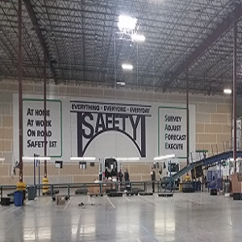

I am a Operations Manager for FedEx Ground in Honolulu.  I am in charge of the inbound sort operation at the Honolulu International Airport facility.  Package handlers unload, load, and scan incoming packages which are placed on vans for delivery.  Safety is FedEx Ground's main goal.  Safety is discussed daily in our presort meetings.  As a manager, I have learned many employees are hestitant to bring up safety issues and concerns to management.  

I am also a part of a Employee Safety Committee that meets once a month with our senior manager to discuss safety issues and concerns.  I help set up these monthly meetings and also pick the committee members.  The committee has addressed numberous concerns that have been resolved.  For example, heat in our warehouse has been an issue.  To resolve this issue, more fans for our building were installed.  I also give awards and recognition on a monthly basis to employees who help promote our safety culture.  Pictures of all of the members are also posted in our building.  By organizing a Safety committee, we hope our employees will feel comfortable bringing up safety concerns to fellow employees who are part of Safety committee so more issues can be addressed and resolved.
