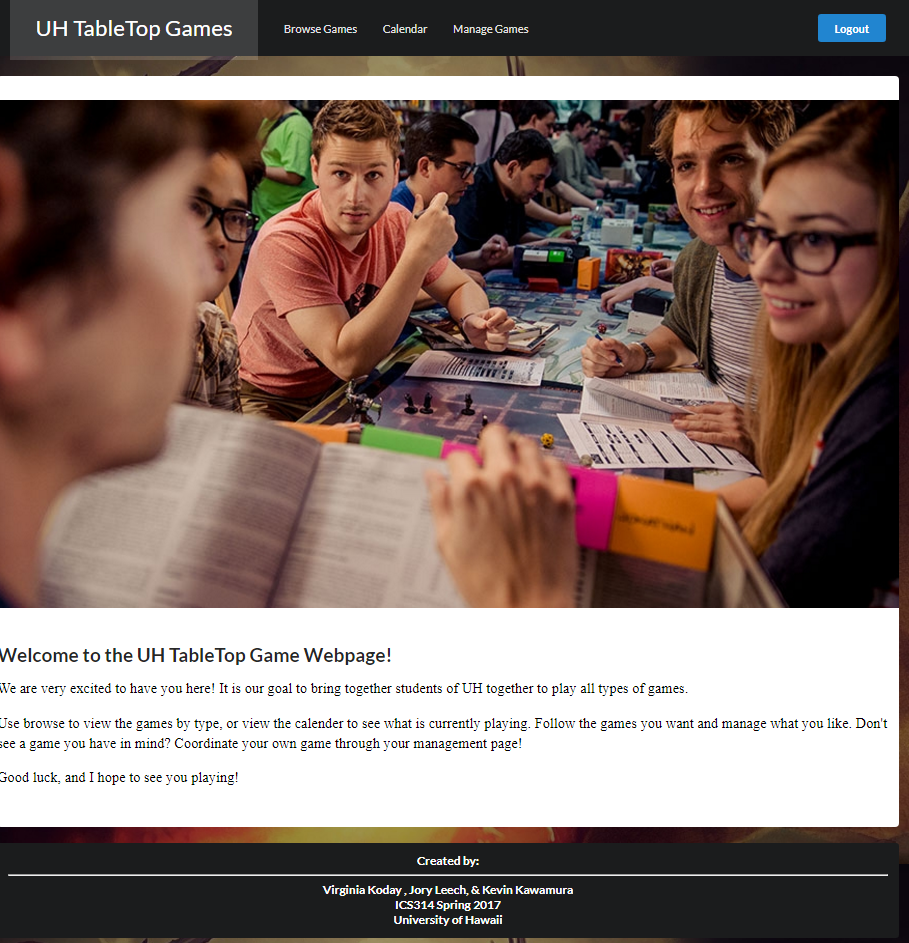
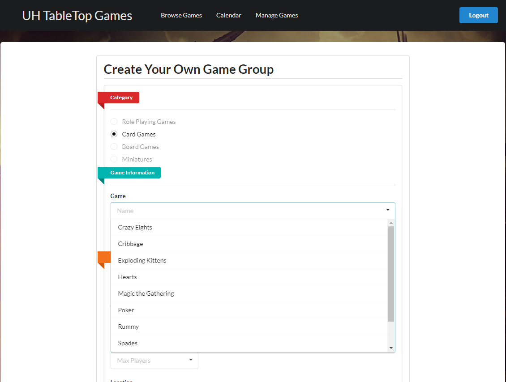

 
Tabletop Manoa is a web application that was created for our final ICS 314 group project.  The application requires users to log in with their active University of Hawaii accounts.  Tabletop Manoa allowed users to browse and join the various available games and also create their own game group.  Users have ability to see which games they created and also the games they have joined.  There is also a Calendar function which allows users to view which games are running on particular days.  The application utilized HTML, Javascript, Semantic UI, Meteor, and MongoDB.

 
 

 

I was in charge of the 'Create Your Own Game Group' page, and I also linked it to a MongoDB collection.  One of my biggest challenges was implementing different dropdowns depending on what game category the user selected.  Since we decided the majority of the input page would be dropdowns, I did not want one humongous dropdown for the selection of the game title.  I learned quite a bit of HTML, Javascript, and Semantic UI from just this project experience alone.  I also became comfortable using GitHub.  I now have a better understanding about Web Development.  One of the biggest things I learned from this project experience was about myself.  I learned that although coding is a lot of work, coding is enjoyable.

## My Fellow Team Members

<ul>
<li><a href="https://kodayv.github.io/">Virginia Koday</a></li>
<li><a href="https://joryleech.github.io/">Jory Leech</a></li>
</ul>

Both of my team members were a real pleasure to work with.  Having a diverse team dynamic really helped with the development of our Web application.  We were able to collaborate on different ideas as well as support each other.

<a href="https://github.com/tabletopmanoa/Tabletop-Manoa-Website">View</a> source code for this project.

