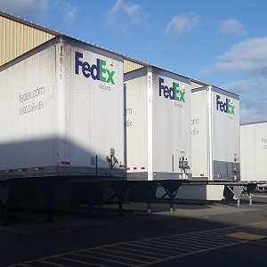

  

I am a Operations Manager at FedEx Ground in Honolulu.  I am in charge of the inbound sort operation at the Honolulu International Airport facility.  Package handlers unload, load, and scan incoming packages which are placed on vans for delivery.   VISION is a FedEx Ground computer mapping application.  VISION was designed to tell package handlers which van a package belongs to and which section of the delivery van the package should be loaded based on the package's address.  Before VISION, package handlers had to look at each package address and refer to a chart to tell them which van a package belonged to and where it belonged in the van.  I was chosen to be responsible for implementing this new application.  I spent a week at the FedEx Ground Headquarters in Pittsburgh, PA for training.  I was told Hawaii was one of last places in the US where VISION was being rolled out, and overall feedback was very positive.  

After returning to Hawaii, I carved out areas of Oahu and assigned them to a specific delivery van and section location.  I was also responsible for training other employees on how to use the new application.  I was pretty excited about VISION.  This would help improve the overall productivity of the inbound sort.  All seemed well until we actually went live.  When we went live, we ran into major problems.  Many Oahu addresses were not recognized by the application.  The way VISION plotted an address was it would look for a street number and a street name.  Then it would refer to a database based off the US postal service to plot the address on our map application.  Without both of them, the address could not be recognized.  Oahu has eleven military bases.  The US postal service has mailrooms on these bases where all of the postal service mail gets delivered.  Unfortunately, these mailrooms will not accept FedEx deliveries (similar to a PO Box address).  Military addresses do not usually have both a street number and street name.  One military address example is Building 199 Schofield HI 96857.  Many packages with military addresses were not being recognized by the new application daily.  I had to work directly with the regional VISION specialist and the software development team to come up with a solution.  According to them, this problem was only specific to Hawaii.  The resolution that was implemented was a manual plot feature which the original application did not have.  Now after countless manual plots, the VISION application runs pretty smoothly.  One of the major things I learned from this is communication plays a big role when changes are implemented.

